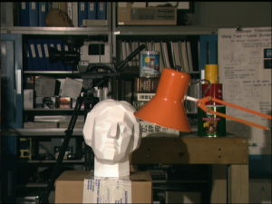
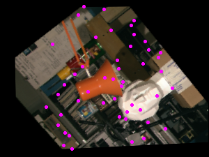
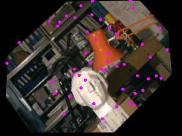

# Mapping Synthetic Correspondence in an Image Pair using Image Augmentations

This repository implements synthetic correspondence mapping in an image pair using torchvision based image augmentations.
The sythetic correspondences can be used to train multiple neural networks like Dense Object Nets and others.

## Example

|Original Image|Synthetic correspondence in Image|Synthetic correspondence in Augmented Image|
|:--:|:--:|:--:|
||||

## Usage

Please refer the script "main.py"

## Dependencies

Install dependencies using:

```bash
pip install -r requirements.txt 
```

## Developer

* Name: Kanishk Navale
* Email: navalekanishk@gmail.com
* Website: <https://kanishknavale.github.io/>
